# 🏢 Sistema de Control de Asistencia — OliverTech

<div align="center">


**Sistema completo de registro y control de asistencia con geolocalización, notificaciones push en tiempo real y panel administrativo web.**

[📡 Backend](#-backend) · [💻 Panel Admin](#-panel-administrativo) · [📱 App Móvil](#-aplicación-móvil)

</div>

---

## 📋 Descripción General

Sistema multiplataforma para la gestión de asistencia de personal, compuesto por tres componentes integrados:

- **API REST** con más de 70 endpoints organizados en 14 módulos
- **Panel administrativo web** con dashboard, reportes y gestión completa
- **App móvil** con registro de asistencia por geolocalización y notificaciones push

---

## ✨ Funcionalidades principales

| Funcionalidad | Descripción |
|---|---|
| 📍 Geofencing | Validación de ubicación GPS con radio configurable en metros |
| 🔔 Notificaciones push | Envío en tiempo real via Firebase Cloud Messaging |
| 👥 Gestión de grupos | Organización de empleados con inscripción masiva a eventos |
| 📅 Eventos | Registro de asistencia a eventos especiales con GPS |
| ⏰ Horarios | Turnos configurables con tolerancia de tardanza |
| 📊 Reportes | KPIs de asistencia, puntualidad y horas trabajadas |
| 🌙 Modo oscuro | Soporte en panel web y app móvil |
| 🔐 Autenticación JWT | Control de acceso por roles (Admin, Supervisor, Empleado) |

---

## 🏗️ Arquitectura del Sistema

```
┌─────────────────────────────────────────────────────┐
│                   CLIENTES                          │
│                                                     │
│   ┌──────────────────┐    ┌──────────────────┐     │
│   │  Panel Admin Web │    │   App Móvil       │     │
│   │  Angular 21      │    │   Flutter         │     │
│   └────────┬─────────┘    └────────┬──────────┘     │
└────────────┼─────────────────────┼───────────────────┘
             │                     │
             ▼                     ▼
┌─────────────────────────────────────────────────────┐
│                  API REST                           │
│             Node.js + Express                       │
│           JWT Auth · Sequelize ORM                  │
└──────────────────────┬──────────────────────────────┘
                       │
          ┌────────────┼────────────┐
          ▼            ▼            ▼
    ┌──────────┐ ┌──────────┐ ┌──────────┐
    │PostgreSQL│ │ Firebase │ │   OSM    │
    │    DB    │ │   FCM    │ │Nominatim │
    └──────────┘ └──────────┘ └──────────┘
```

---

## 💻 Panel Administrativo

**Repositorio:** [`attendance-system-admin`](https://github.com/Oliverzam/attendance-system-admin)

### Stack
- **Framework:** Angular 21 (standalone components)
- **UI:** Angular Material 21 + Material 3
- **Gráficas:** Chart.js · **Mapas:** Leaflet.js + OpenStreetMap

### Screenshots

| Dashboard | Empleados |
|---|---|
| 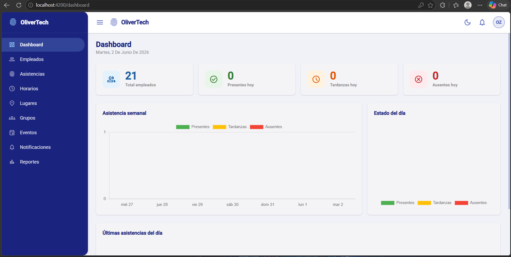 | 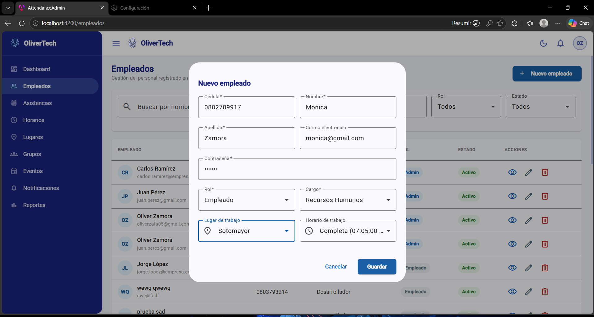 |

| Horarios | Lugares |
|---|---|
| 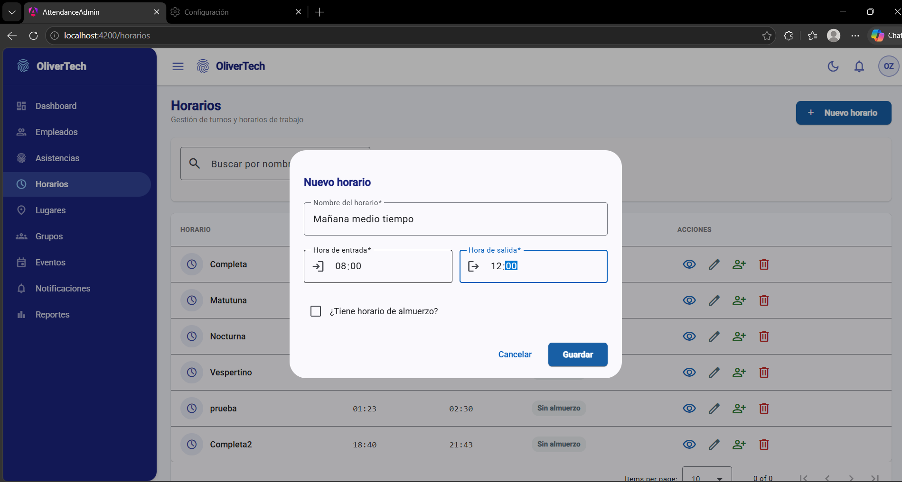 | 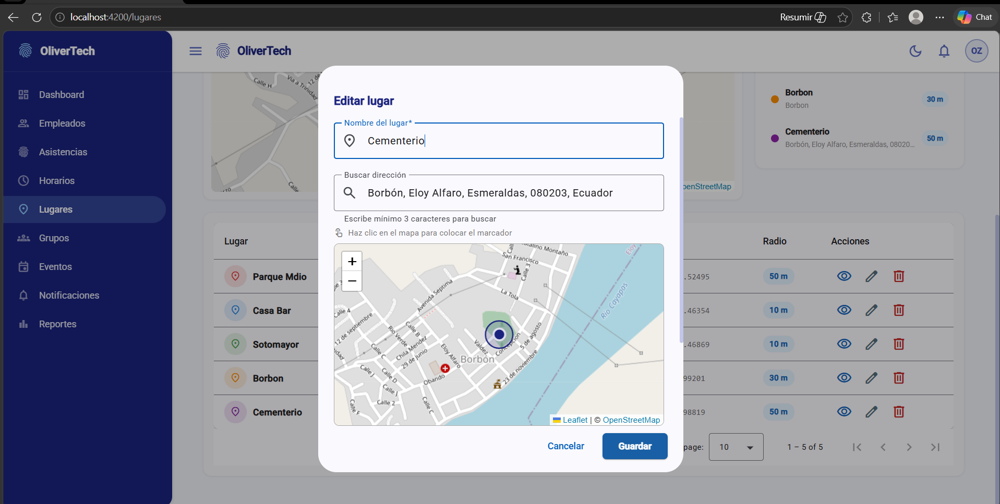 |

| Grupos | Eventos |
|---|---|
| 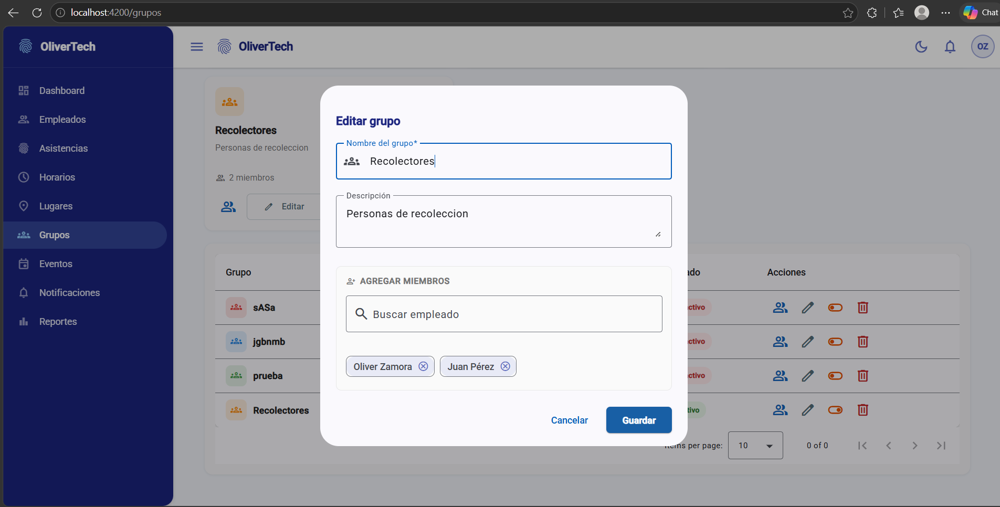 | 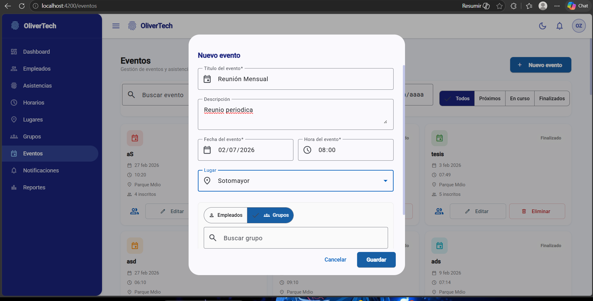 |

| Reportes | Notificaciones |
|---|---|
| 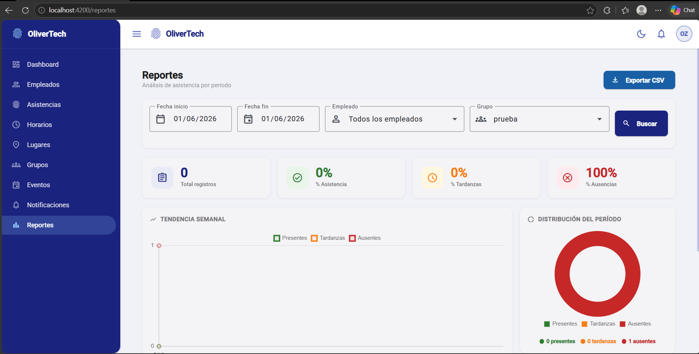 | 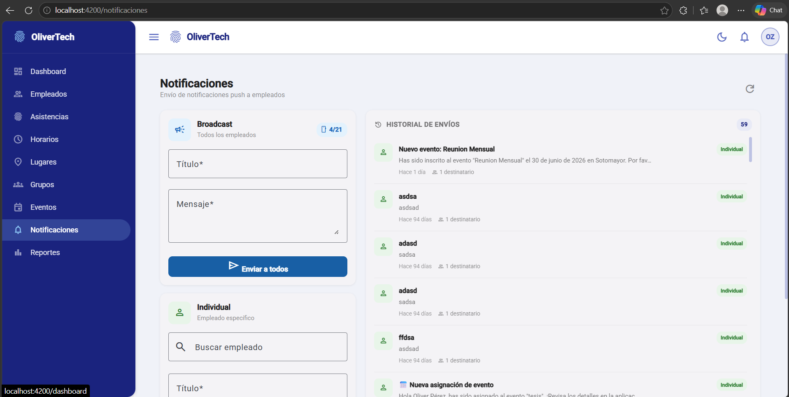 |

### Módulos
- 📊 Dashboard · 👥 Empleados · ✅ Asistencias · ⏰ Horarios
- 👫 Grupos · 📍 Lugares · 📅 Eventos · 🔔 Notificaciones · 📈 Reportes

### Instalación
```bash
git clone https://github.com/Oliverzam/attendance-system-admin
cd attendance-system-admin
npm install
ng serve
```

---

## 📱 Aplicación Móvil

**Repositorio:** [`attendance-system-app`](https://github.com/Oliverzam/attendance-system-app)

### Stack
- **Framework:** Flutter (Dart)
- **Notificaciones:** Firebase Cloud Messaging
- **Mapas:** flutter_map + OpenStreetMap · **Calendario:** table_calendar

### Screenshots

| Login | Home | Asistencia |
|---|---|---|
| 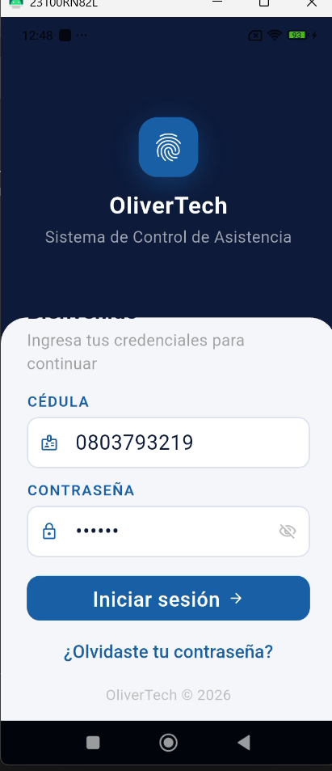 | 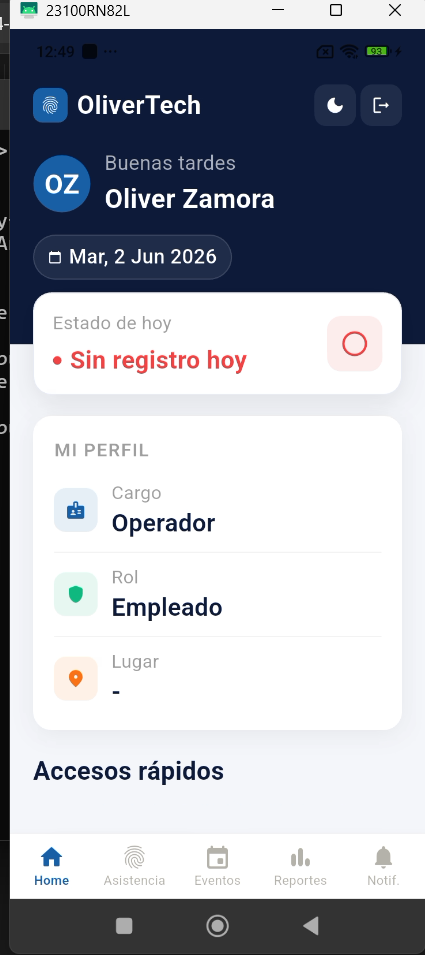 | 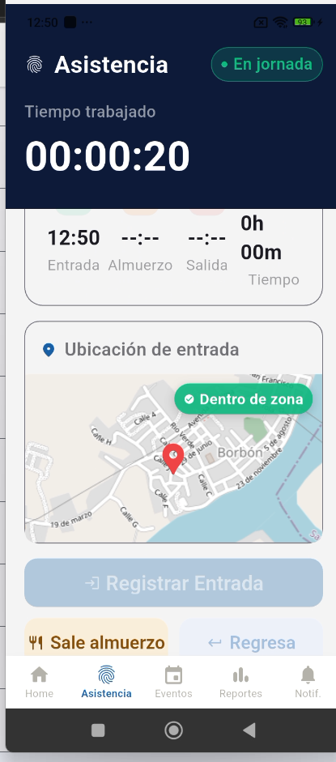 |

| Eventos | Reportes | Notificaciones |
|---|---|---|
| 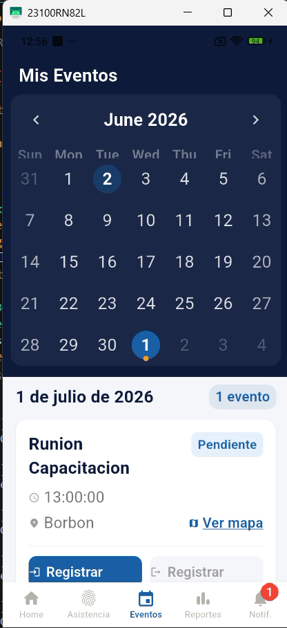 | 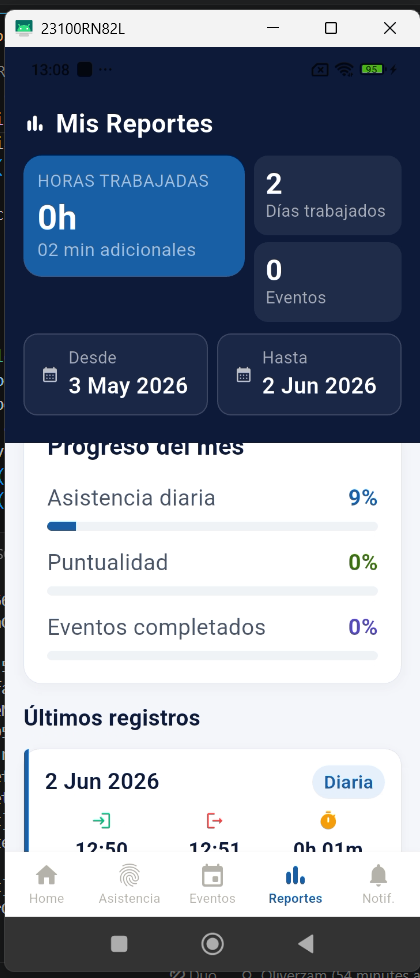 | 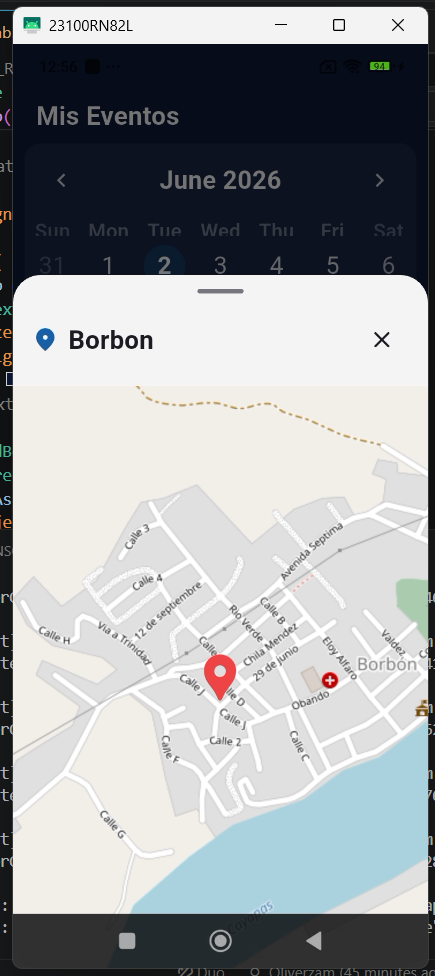 |

### Instalación
```bash
git clone https://github.com/Oliverzam/attendance-system-app
cd attendance-system-app
flutter pub get
flutter run
```

---

## 📡 Backend

**Repositorio:** [`attendance-system-api`](https://github.com/Oliverzam/attendance-system-api)

### Stack
- **Runtime:** Node.js + Express.js
- **ORM:** Sequelize v6 + PostgreSQL
- **Auth:** JWT + bcryptjs · **Notificaciones:** Firebase Admin SDK

### Módulos de la API

| Módulo | Prefix | Descripción |
|---|---|---|
| Auth | `/api/auth` | Login con cédula o email |
| Empleados | `/api/empleados` | CRUD + roles y cargos |
| Asistencias | `/api/asistencias` | Entrada, salida, geofencing |
| Horarios | `/api/horarios` | Turnos y asignación |
| Grupos | `/api/grupos` | Organización de personal |
| Eventos | `/api/eventos` | Eventos especiales |
| Lugares | `/api/lugares` | Zonas de geofencing |
| Notificaciones | `/api/notificaciones` | Push broadcast e individual |

### Instalación
```bash
git clone https://github.com/Oliverzam/attendance-system-api
cd attendance-system-api
cp .env.example .env
docker-compose up -d
```

---

## 👨‍💻 Autor

**Oliver Zamora Fajardo**  
Ingeniero en Software — Universidad Técnica del Norte

[](https://linkedin.com/in/oliver-zamora-fajardo-5b653629b)
[](https://github.com/Oliverzam)
📧 oliverzafa05@gmail.com

---

<div align="center">
<strong>OliverTech © 2026</strong>
</div>